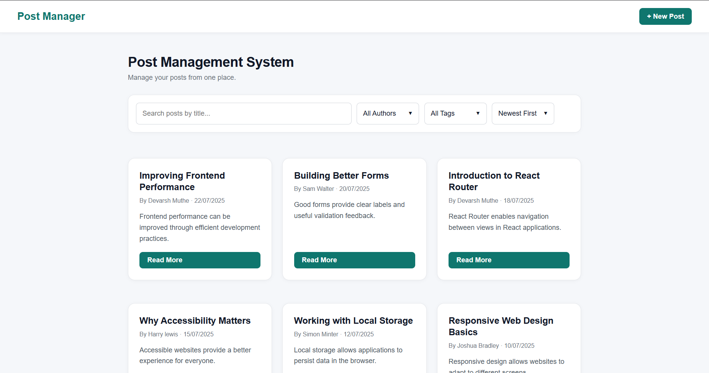
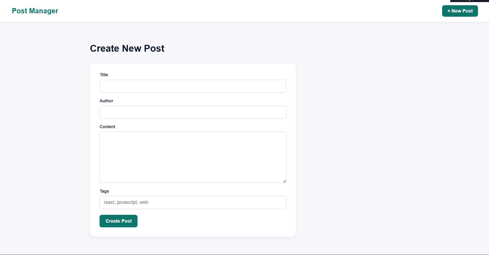
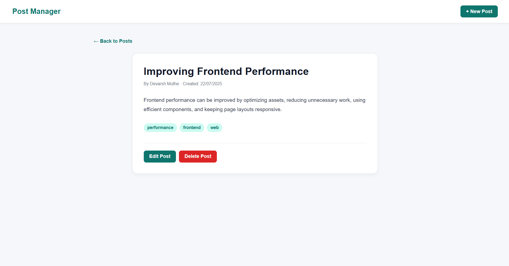
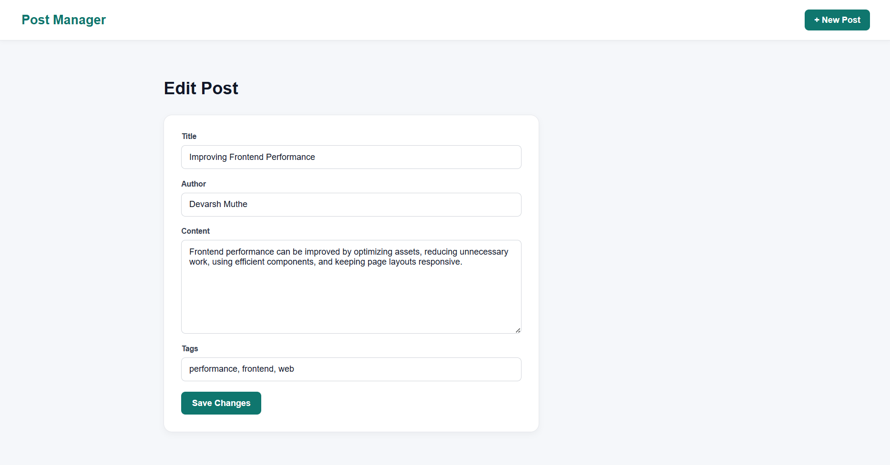
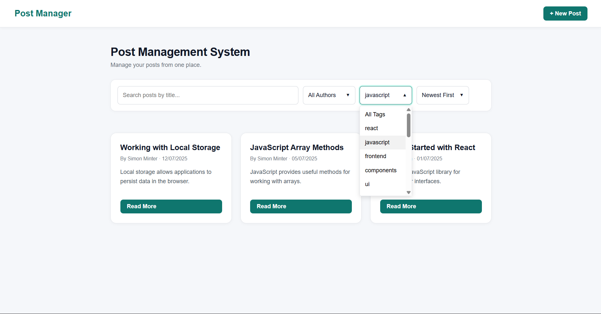

# Post Management System

A simple and responsive Post Management System built with React. The application allows users to create, view, edit, delete, search, filter, and sort posts. Post data is stored in the browser using Local Storage.

## Features

- Create new posts
- View individual posts
- Edit existing posts
- Delete posts with confirmation
- Search posts by title
- Filter posts by author
- Filter posts by tags
- Sort posts
- Persistent data using Local Storage
- Seed posts for initial data
- Form validation
- Toast notifications for user actions
- Responsive design for desktop and mobile devices
- Custom dropdown menus with scrolling
- Preserves filters when navigating back to the post list
- Post metadata including creation and update dates

## Screenshots

### Post List



### Create Post



### Post View



### Edit Post



### Filtering and Sorting



## Tech Stack

- React
- JavaScript
- React Router
- HTML
- CSS
- Local Storage
- Vite

## Project Structure

```text
post-management-system/
│
├── screenshots/
│   ├── post-list.png
│   ├── create-post.png
│   ├── post-view.png
│   ├── edit-post.png
│   └── filtering.png
├── public/
│
├── src/
│   │
│   ├── assets/
│   │
│   ├── components/
│   │   ├── AuthorDropdown.jsx
│   │   ├── Header.jsx
│   │   ├── PostCard.jsx
│   │   ├── SortDropdown.jsx
│   │   └── Toast.jsx
│   │
│   ├── pages/
│   │   ├── PostCreate.jsx
│   │   ├── PostEdit.jsx
│   │   ├── PostList.jsx
│   │   └── PostView.jsx
│   │
│   ├── utils/
│   │   └── seedPosts.js
│   │
│   ├── App.jsx
│   ├── index.css
│   └── main.jsx
│
├── .gitignore
├── eslint.config.js
├── index.html
├── package-lock.json
├── package.json
└── README.md
```

## Getting Started
### Prerequisites

Make sure you have Node.js and npm installed on your system.

### Installation

1. Clone the repository:
```
git clone https://github.com/DESPITEOFIT/post-management-system.git
```
2. Navigate to the project directory:
```
cd post-management-system
```
3. Install the dependencies:
```
npm install
```
4. Running the Application
Start the development server:
```
npm run dev
```
The application will be available at the local URL shown in the terminal.

## Usage
- Creating a Post
- Click the New Post button.
- Enter the title, author, content, and optional tags.
- Submit the form.
- The new post will be saved to Local Storage and displayed on the home page.
- Editing a Post
- Open a post using Read More.
- Click Edit Post.
- Modify the required information.
- Save the changes.
- Deleting a Post
- Open the post.
- Click Delete Post.
- Confirm the deletion.
- The post will be removed from Local Storage.
- Searching and Filtering

## Posts can be searched by title and filtered using:

- Author
- Tags
- Sorting options

Filters are preserved when navigating between the post list and individual posts.

## Data Storage

The application uses the browser's Local Storage to store posts.

The stored data is kept under:
```
posts
```
This allows posts created or modified through the application to remain available after refreshing the page or restarting the development server.

The application also provides seed posts for initial data.

## Form Validation

The post creation and editing forms validate required fields.

- Title is required.
- Author is required.
- Content is required.
- Content must contain at least 20 characters.

Validation errors are displayed directly below the relevant form fields.

## Responsive Design

The interface is designed to work across different screen sizes, including:

- Desktop
- Tablet
- Mobile

The post grid, navigation, forms, filters, and action buttons adapt to smaller screens.

## Future Improvements

Possible future improvements include:

- Backend database integration
- User authentication
- Image uploads
- Comments
- Pagination
- Like and bookmarking functionality
- API-based data storage
- Cloud deployment

## License

This project is developed for educational purposes.

## Author

Devarsh Muthe